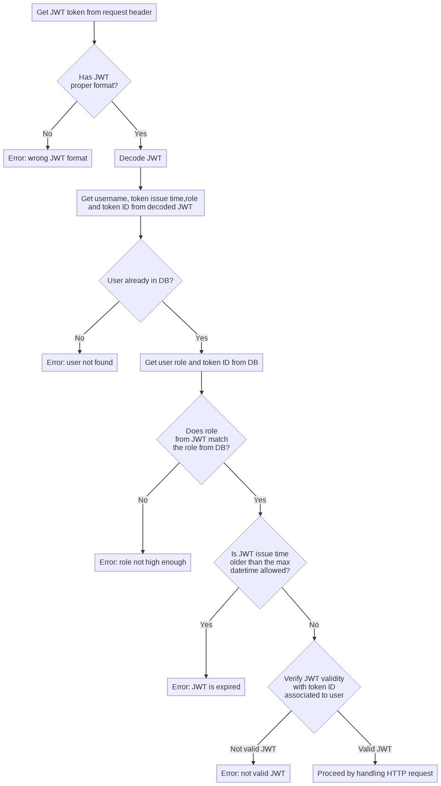
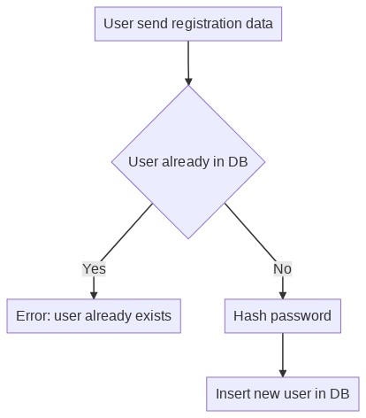
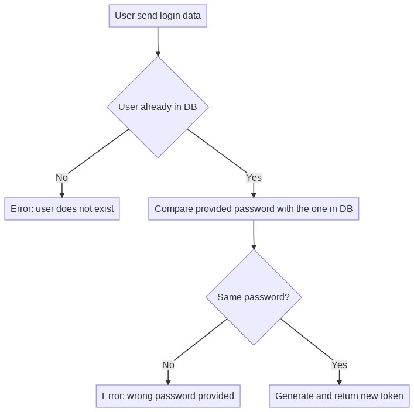
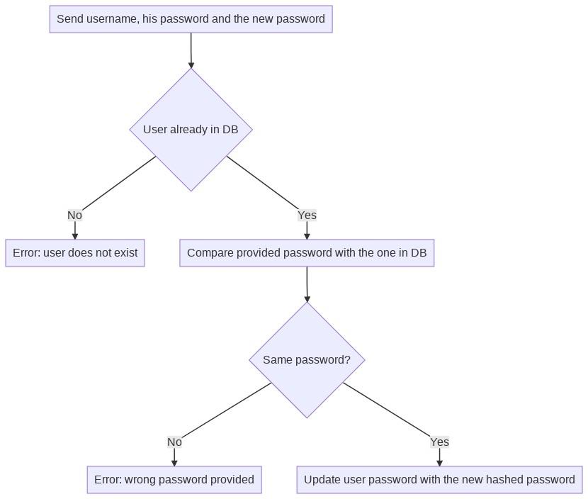
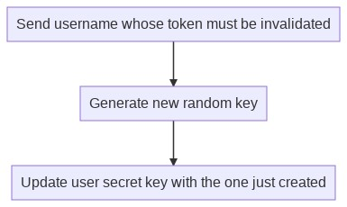

# JWT-test

This is a simple JWT manager that allows you to change passwords, change roles, revoke access based on a username
or a past date.

There is no frontend included but the test mechanism and interactive documentation allow you to manipulate the API.

The JWT validation mechanism is based on a symmetrical secret key; there is one secret key for each registered user
(I used a DB to store such keys and other informations), so if I wanted to invalidate a user's JWT, all I had to do was
change the secret key associated with that user: any subsequent validation of the user would fail because the JWT
check would be based on the user's new secret key. 

## Usage

1. Clone this repository
2. `npm install`
3. `npm run start` if you want to run the server and read the [documentation](#documentation)
4. `npm run test` if you want to run all tests

## Table of contents

> 1 [Documentation](#documentation)
>
> 2 [JWT payload](#jwt-payload)
>
> 3 [Database structure](#database-structure)
>
> 4 [Validation](#validation)
>
>> 4.1 [API involved in validation process](#api-involved-in-validation-process)
>
> 5 [API](#api)
>
>> 5.1 [Register](#register)
>
>> 5.2 [Login](#login)
>
>> 5.3 [Password reset](#password-reset)
>
>> 5.4 [Change roles](#change-roles)
>
>> 5.5 [Invalidate token by user name](#invalidate-token-by-user-name)
>
>> 5.6 [Invalidate token by datetime](#invalidate-token-by-datetime)
>
> 6 [Tech stack](#tech-stack)

## Documentation

API documentation is autogenerated thanks to `Swagger`: in order to read such documentation,
run `npm run start` in a terminal and then go to [localhost:3000/documentation](http://localhost:3000/documentation).
Swagger lets you read API documentation and perform HTTP operations of such API, all in the same page.

[Back to table of contents](#table-of-contents)

## JWT payload

The following object describes our JWT payload: it is very light and contains all that we needs.

```js
{
  username,       // string
  email,          // string
  role,           // string
  iat: Date.now() // number (Unix Epoch in milliseconds)
}
```

[Back to table of contents](#table-of-contents)

## Database structure

Here's the structure of our only table in DB, `users`: 

```js
knex.createTableIfNotExists('users', table => {
  table.increments('id')
  table.string('email')
  table.string('username')
  table.string('password')
  table.string('token_key')
  table.string('role')
  table.boolean('invalidated').defaultTo(false)
})
```

Most interesting columns are:
* `token_key`: this is the random string used to sign a JWT associated to a logged in user; if we change `token_key` for
  a user, any further validation of JWTs issued before changing `token_key` will fail;
* `role`: for now it is only a enumerated value (such as `guest` or `admin`): no permission table is implemented for now;
* `invalidated`: if a JWT is invalidated by telling what username will no longer access to API services, this column is `true`.

[Back to table of contents](#table-of-contents)

## Validation

The validation process takes place before fulfilling the HTTP request: it checks whether the token included in the request header is valid.

The validation process is made of several steps:

1 - role in JWT must match the role the user has in DB: if not, JWT is *unauthorized*

2 - `iat` JWT field must be lesser than a certain datetime: if not, JWT is *expired*

3 - JWT must pass the validity check: if not, JWT is *invalid* 

[Back to table of contents](#table-of-contents)

### API involved in validation process

API functions involved in this validation are:

* `getUser` (`/api/users/:username`)
* `revoke` (`/api/auth/tokens/revoke/:username`)
* `passwordReset` (`/api/auth/passwordreset`)
* `changeRoles` (`/api/auth/changeroles`)
* `revokeOlder` (`/auth/tokens/revokeolder/:datetime`)

Following the sequence diagram of the validation process, which includes user check, permissions check,
JWT expiration check and JWT validity checks.



[Back to table of contents](#table-of-contents)

## API 

## Register

By providing new username, email and password a new user will be stored in DB:
its password will be hashed before actually putting the new record in DB.
Each user has its own secret key: this is the key that will be used in `jwt.verify()`



[Back to table of contents](#table-of-contents)

## Login

By providing new username, email and password a new JWT will be returned to the user
if user already exists in DB and provided password matches the one stored in DB.



[Back to table of contents](#table-of-contents)

## Password reset

By providing username, user old password and user new password the old password stored in DB
will be replaced with the new one provided.



[Back to table of contents](#table-of-contents)

## Change roles

By providing username and role, updates provided role for provided user.

[Back to table of contents](#table-of-contents)

## Invalidate token by user name

By providing a username, the JWT associated with such username will be invalidated by
storing a new random `token_id` in the DB record associated with the user: this way,
future validation in `jwt.verify()` will fail because the `token_id` used to sign JWT
is now different.



[Back to table of contents](#table-of-contents)

## Invalidate token if older than a certain date

By providing a date, any token signed on a date prior to the date provided will be
invalidated.

[Back to table of contents](#table-of-contents)

## Tech stack

* server: `Fastify` ecosystem
* database: `SQLite` under `Knex`
* JWT manipulation: `jsonwebtoken`
* test: `tap`
* documentation: `swagger`
* charts: `mermaid`

[Back to table of contents](#table-of-contents)
